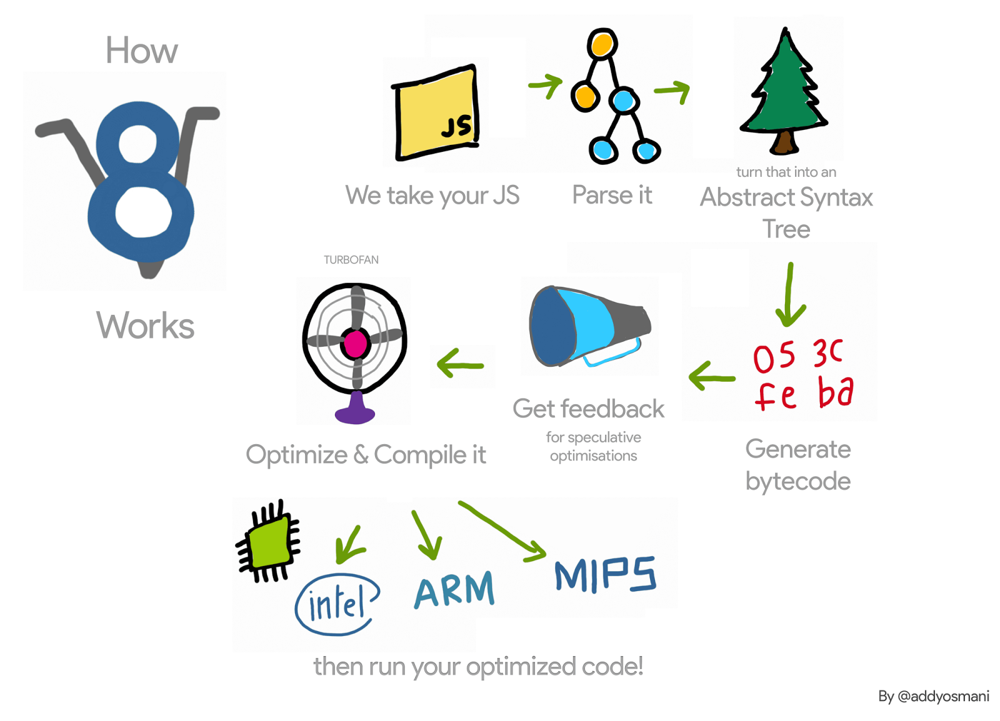

# Node.js e a V8 Engine

## Introdução

Sabe-se que o Javascript é uma linguagem que roda em browsers, ou seja, sempre que a página em que o script roda é carregada, todo o código Javascript é executado. O Nodejs basicamente pega o Javascript e transporta para outro ambiente, o sistema operacional \(Servidores rodam em sistemas operacionais\).

**Isso basicamente te permite não só executar o Javascript em um browser, mas em qualquer ambiente de sistema operacional.** Seu código JavaScript irá rodar fora dos browsers.

Vale lembrar também que o Node.js não possui estrutura visual, em vez disso ele tem funcionalidades necessárias em servidores, como por exemplo, HTTP library ou filesystem API \(Sem a utilização do Node, manipulação de arquivos por exemplo, não seria possível\).

Como tal, o ambiente omite APIs JavaScript específicas do navegador e adiciona suporte para APIs de sistema operacional mais tradicionais, incluindo bibliotecas de sistemas HTTP e File System.

## O que é a V8 Engine?

V8 é basicamente a engine por trás do Google Chrome que decifra seu código Javascript e traduz em código de máquina, para que o código seja processado, atualmente é utilizada no navegador Chrome.

Quando se utiliza o Google Chrome, e ele detecta o Javascript em uma página, por muitas vezes entre as tags `` o código passará pela V8 engine que irá processar o código Javascript, para que o resultado desse código seja retornado o Chrome, seja mostrar algo no console, ou execução de mídia em páginas web.

### Por quê o Node usa a V8?

A engine V8 é open source construída em C++ para compilar Javascript no Google Chrome, assim o criador do Node Ryan Dahl, modificou o código fonte da engine para que ela rodasse também fora dos navegadores em sistemas operacionais como Linux e Windows.

O mais importante aqui é saber que você não executa seus projetos Node.js em um browser, em vez disso são executados no computador que estiver usando. Não há relação entre a engine V8 e os browsers Firefox, Safari, etc. Cada browser tem seus próprios interpretadores. 

**Porém é comum abrirmos nosso servidor Node.js em browsers, deve-se saber que todo o processo de envio do que está sendo mostrado no browser é feito no servidor, Node.js rodando JavaScript e enviando respostas ao navegador, tudo no sistema operacional.**

### A V8 modificada pelo Node.js

O desenvolvimento do Node.js modificou a V8 engine para que pudesse atender funcionalidades que são necessárias em servidores, como ler arquivos, enviar respostas HTTP. Tal funcionalidades que não são suportadas pelos browsers.

### Mas por quê ainda se utiliza o browser quando se cria aplicações utilizando o Node.js?

Como dito anteriormente, o Nodejs possibilita a execução do Javascript no servidor \(em algum sistema operacional\) então quando acessamos um link como esse [http://localhost:8000/](http://localhost:8000/), ao criar aplicações Node, estamos acessando um servidor que está em execução mandando como resposta o que está sendo mostrado no browser, através de um navegador.

